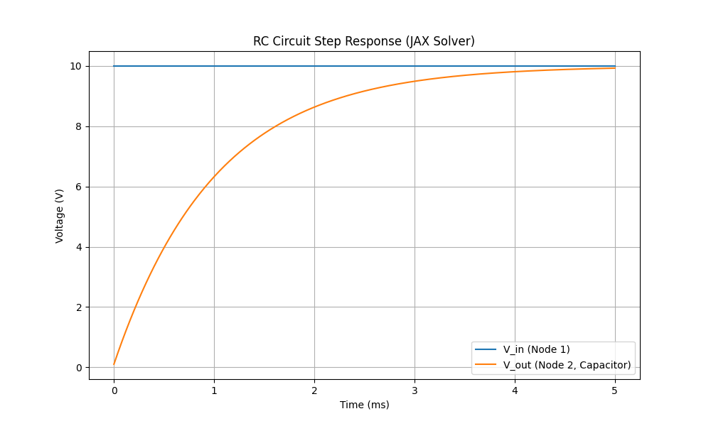

# Maxwell's Hammer

A JAX-native SPICE solver using Python.

## Description

Maxwell's Hammer is a circuit simulator (SPICE-like) built on top of [JAX](https://github.com/google/jax). By leveraging JAX, it provides:

-   **Autograd**: Automatic differentiation with respect to any circuit parameter.
-   **JIT Compilation**: Fast execution of circuit solvers using XLA.
-   **Vectorization**: Efficient batch processing of circuit simulations.

## Installation

```bash
pip install -r requirements.txt
```

## Usage

See `examples/` for usage examples.

```python
from maxwells_hammer.components import Resistor, Capacitor, VoltageSource
from maxwells_hammer.circuit import Circuit
from maxwells_hammer.solver import solve_transient

# Define your circuit...
```

## Example Output

Step response of an RC circuit simulated with Maxwell's Hammer:



## Status

Very experimental. Supports basic linear passives (R, C) and ideal sources.
